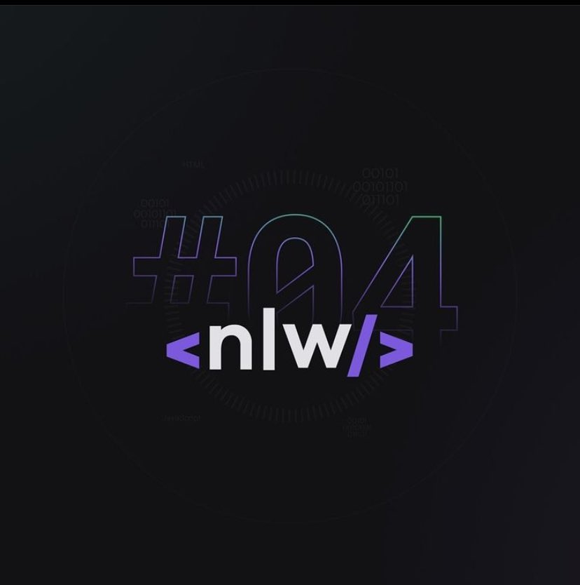

<h1 align="center">
    
</h1>

<h1 align="center">
    Moveit | NLW4
</h1>

## :wrench: Project
Moveit is an app created for those who spend a lot of hours in front of the computer and don't even remember to stand up and stretch their body a little and have a small break to their eyes. 
So, in order to help their health, Moveit has a countdown that, when it reaches to zero, the user receive a simple challenge, an eye or a body exercise. When the user complete the task provided,
he will receive an amount of experience, that will increase his level. If the user fails the challenge, he will not receive experience at all.

<h1 align="center">
    
</h1>

## :rocket: Technologies

- [Next.js][nextjs]
- [TypeScript][typescript]
- [ReactJS][react]
- [Yarn][yarn]


[nextjs]: https://nextjs.org
[typescript]: https://www.typescriptlang.org
[react]: https://reactjs.org
[yarn]: https://yarnpkg.com


## :hammer: Usage
### You need to install git, node and yarn ( or use npm )
```
# Clone Repository
$ git clone https://github.com/Eduardorib/Move-Quest

# Go to server folder
$ cd Move-Quest

# Install Dependencies
$ yarn

# Run Aplication
$ yarn dev

# Access localhost
http://localhost:3000
```
